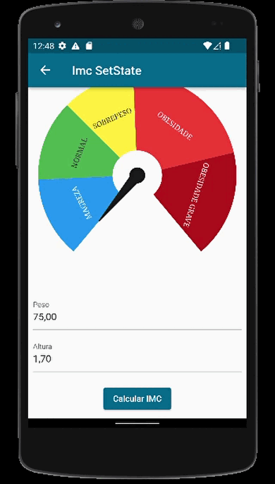

# Calculadora de Índice de Massa Corporal (IMC) em Flutter

Este aplicativo Flutter é uma calculadora de Índice de Massa Corporal (IMC), uma ferramenta comumente usada para avaliar se uma pessoa está dentro da faixa de peso considerada saudável. Com quatro tipos de gerencia de estado (SetState, ValueNotifier, ChangeNotifier, BlocPattern).

## Funcionalidades

- _Cálculo Simples:_ Insira seu peso e altura para obter seu IMC instantaneamente.
- _Classificação:_ Receba uma classificação com base nas categorias tradicionais de IMC.
- _Interface Intuitiva:_ Design simples e fácil de usar.

## Capturas de Tela

### SetState

Para mais informações sobre o SetState clique no link abaixo
[SetState](https://www.youtube.com/watch?v=GMrvZsmgW34)

### ValueNotifier

Para mais informações sobre o ValueNotifier clique no link abaixo
[ValueNotifier](https://www.youtube.com/watch?v=XF4dWcH2-So)

### ChangeNotifier

Para mais informações sobre o ChangeNotifier clique no link abaixo
[ChangeNotifier](https://www.youtube.com/watch?v=C_-ZKL52Xn8)

### BlocPattern(Stream)

Para mais informações sobre o BlocPattern clique no link abaixo
[BlocPattern](https://pub.dev/packages/bloc_pattern)

## Como Executar

Certifique-se de ter o Flutter instalado. Em seguida, execute os seguintes comandos:

bash
flutter pub get
flutter run

## Tecnologias Utilizadas

- Flutter
- Dart

## Contribuições

Contribuições são bem-vindas! Sinta-se à vontade para abrir issues ou enviar pull requests para melhorar este aplicativo de IMC em Flutter.

## Licença

Este projeto é licenciado sob a [Licença MIT](LICENSE).
